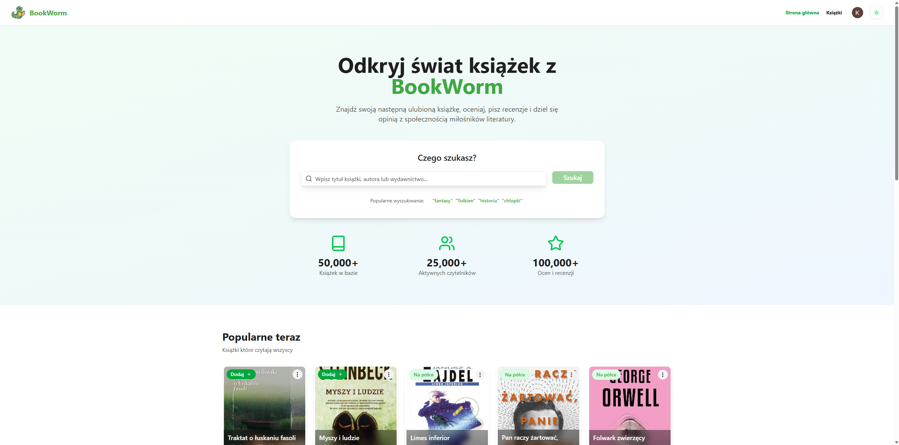
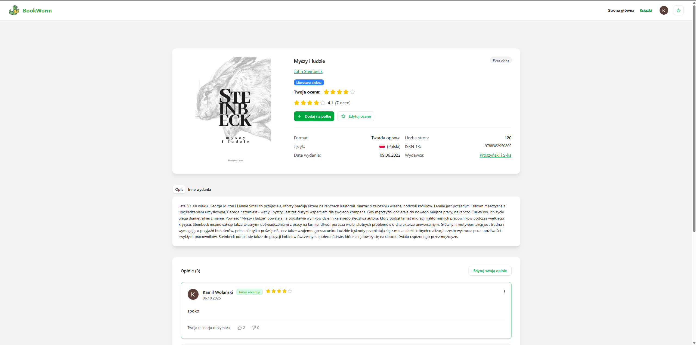
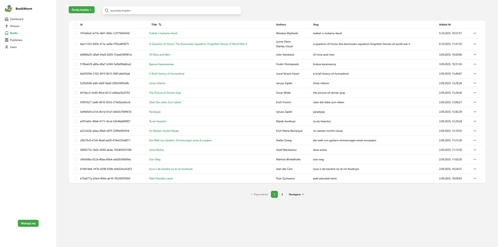
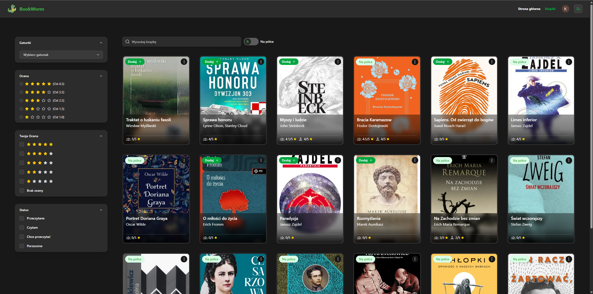
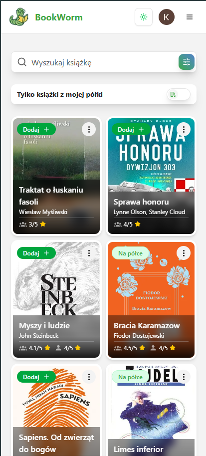

# 📚 BookWorm  

> Pełnoprawna aplikacja do katalogowania książek z panelem administracyjnym i prywatną biblioteką czytelnika.  
> Projekt przebudowany na **Next.js 15** z wykorzystaniem **Partial Prerendering**, **Cache Components** oraz **SWR**.  
> 🔗 Live: https://bookworm.today

---

## ✨ Funkcje

- 🧭 **Panel administratora**  
  Dodawanie i edycja książek, wydań, autorów oraz wydawców

- 👤 **Strony autorów**  
  Osobne profile autorów z listą książek  
  (przygotowane pod **ISR / Partial Prerendering**)

- 📸 **Okładki i zdjęcia autorów**  
  Upload plików do **Cloudinary** (signed uploads + limity)

- 🧾 **Profile książek i wydań**  
  Format, język, ISBN, opis, wydanie, oceny

- 🔍 **Wyszukiwanie i filtrowanie**  
  Po tytule, gatunku, statusie, ocenie

- ⭐ **Recenzje i oceny**  
  Komentarze użytkowników + średnia ocena

- 📚 **Moja półka czytelnika**  
  Statusy:
  - czytam  
  - przeczytane  
  - chcę przeczytać  
  - porzucone  

- ⚡ **Optimistic UI**  
  Natychmiastowa reakcja interfejsu przy:
  - zmianie statusu książki  
  - ocenach  
  - interakcjach użytkownika  

- 🌗 **Dark mode** + pełne **RWD**

- 🔐 **Logowanie Google**  
  NextAuth v5 + systemowe e-maile powitalne (Resend)

- 🧠 **Bezpieczeństwo**
  - role administratora  
  - walidacja danych (Zod)  
  - podpisane uploady  
  - separacja logiki server / client  

---

## 🛠️ Stack technologiczny

| Warstwa | Technologie |
|------|------------|
| 🌐 **Frontend** | Next.js 15 (App Router, Partial Prerendering), React 19 |
| 🎨 **UI** | TailwindCSS v4, shadcn/ui, Radix UI, lucide-react |
| 💾 **Baza danych** | PostgreSQL (Neon) + Prisma ORM |
| 🔐 **Autoryzacja** | NextAuth v5 (Google OAuth) + Prisma Adapter |
| ☁️ **Media** | Cloudinary (signed uploads) |
| ✉️ **E-maile** | Resend + React Email |
| 🧮 **Formularze** | React Hook Form + Zod |
| 🔁 **Data fetching** | Server Components + SWR |
| 🚀 **Hosting** | Vercel |

---

## 🧠 Data Fetching & Cache

Projekt wykorzystuje **hybrydowe podejście do pobierania danych**.

### 🔹 Server-first
- Dane pobierane na serwerze (Server Components)
- Wykorzystanie **Next.js Cache / fetch cache**
- Lepsze SEO i szybszy TTFB

### 🔹 Client cache (SWR)
Wybrane interakcje (status książki, oceny, półka użytkownika):

- dane startowe przekazywane z serwera do klienta  
- cache po stronie klienta (SWR)  
- **optimistic response**  
- rewalidacja w tle  

Efekt: ⚡ szybkie UI + spójność danych

---

## 🧱 Architektura

- **Next.js App Router**
- **Partial Prerendering (PPR)**  
  Połączenie statycznego HTML + dynamicznych fragmentów
- **Server Actions** – mutacje danych
- **Cache Components** – granularna kontrola cache
- **ISR / PPR-ready pages** (strony autorów)
- **Cloudinary**  
  W bazie przechowywane tylko `publicId` + `secureUrl`

---

## 🧱 Roadmap (co dalej?)

BookWorm to projekt aktywnie rozwijany — poniżej kilka planowanych kroków 👇

- [ ] 📝 **Markdown (MDX)** dla opisów książek i bio autorów  
- [ ] 🧪 **Testy jednostkowe i E2E** (Vitest + Playwright)  
- [ ] 📊 **Lighthouse CI + testy wydajności / coverage**  
- [ ] 🌐 **Tłumaczenie PL/EN** – pełne i18n  

---

## 📸 Screeny

**Ekran główny**

**Ekran wyszukiwania**

**Szczegóły książki**

**Panel admina**

**Tryb ciemny**

**Wersja mobile**

Wszystkie zrzuty ekranu znajdziesz w katalogu `/docs/screenshots`.

> 📍 Zobacz wersję live, jeśli chcesz zobaczyć więcej:  
> 🔗 **[https://bookworm.today](https://bookworm.today)**

---

## 🤝 Autor

👨‍💻 **Kamil Wolański**  
Frontend Developer – Next.js / React / TypeScript 
📫 kwolanski3@gmail.com

---

## 🪪 Licencja

**MIT**  
© 2025 

